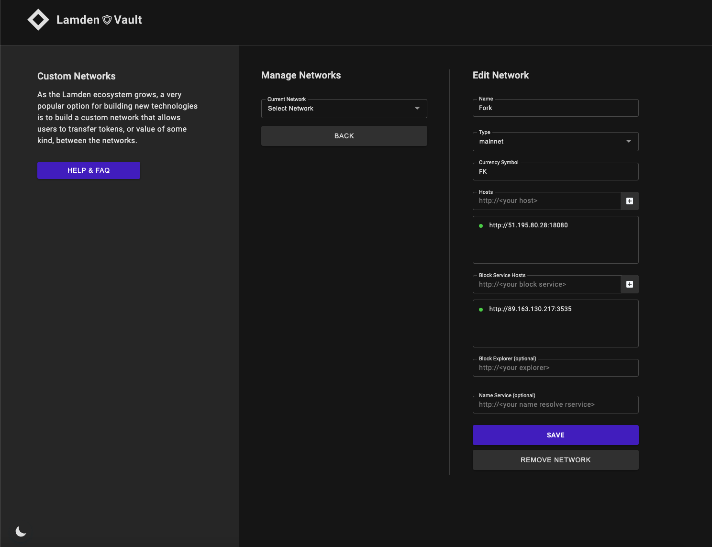

v1.0 - This README is already for the forked version

# Forked Node Package
This repository contains a modified lamden node package. It consists of several containerized applications: the [node software](https://github.com/Lamden/lamden), the [webserver](https://github.com/Lamden/lamden/blob/master/lamden/nodes/masternode/webserver.py) and the [events service](https://github.com/Lamden/lamden/blob/master/lamden/nodes/events.py).

**You wont be able to run this node unless you joined as a masternode operator with your node wallet.**

### Dependencies
- [Python](https://www.python.org/) 3.6 or above
- [GNU make](https://www.gnu.org/software/make/)
- [Docker](https://docs.docker.com/get-docker/)
- [Docker Compose](https://docs.docker.com/compose/install/)

#### First run
After cloning this repository, cd into it and run:
```bash
$ python -m venv venv
$ . venv/bin/activate
$ pip install -r requirements.txt
$ rm -rf /root/.lamden
$ mkdir /root/.lamden
$ cp genesis_block.json /root/.lamden
$ export LAMDEN_TAG=v2.0.45
$ export CONTRACTING_TAG=v2.0.10
$ export LAMDEN_SK=YOUR_NODE_SK
$ export LAMDEN_BOOTNODES=51.195.80.28
$ make build
$ make boot && docker logs -f lamden_node
```

#### Stopping
cd into the cloned repo and run:
```bash
$ . venv/bin/activate
$ export LAMDEN_TAG=v2.0.45
$ export CONTRACTING_TAG=v2.0.10
$ export LAMDEN_SK=YOUR_NODE_SK
$ export LAMDEN_BOOTNODES=51.195.80.28
$ make teardown
```

#### Run after first run
cd into the cloned repo and run:
```bash
$ . venv/bin/activate
$ export LAMDEN_TAG=v2.0.45
$ export CONTRACTING_TAG=v2.0.10
$ export LAMDEN_SK=YOUR_NODE_SK
$ export LAMDEN_BOOTNODES=51.195.80.28
$ make boot && docker logs -f lamden_node
```

#### Other
```bash
# Viewing the logs
$ docker logs <lamden_node|lamden_webserver|lamden_events>

# Real-time resource usage
$ docker stats
```

#### You want to use the new network as a normal user?
You can add the network to your Lamden Wallet like this:


